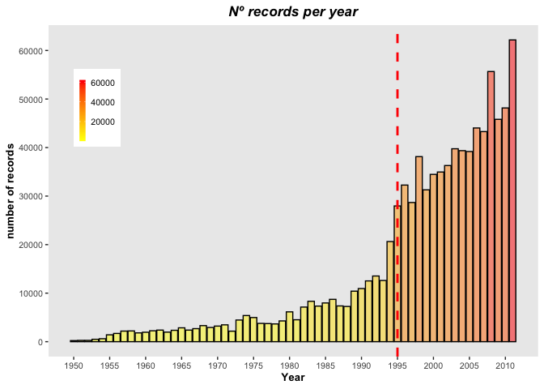
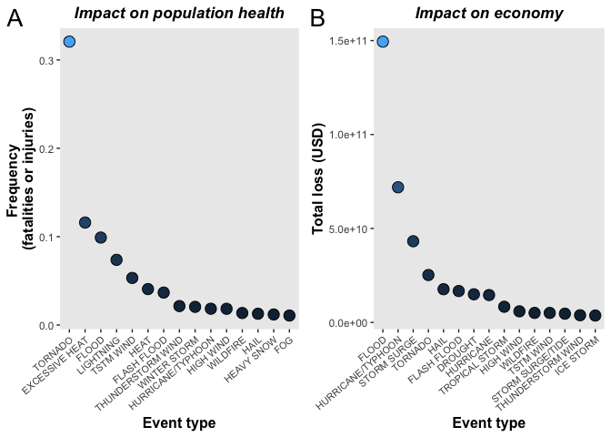

=========================================================================================================
IMPACT OF SEVERE WEATHER EVENS ON **PUBLIC HEALTH** AND **ECONOMY** IN THE UNITED STATES
=========================================================================================================

  
  
## Synopsis
___________________________________________________________________________________________
This project was aimed at identifying the relationship between storms and other severe weather events in public health and economic problems for communities and municipalities in the United States. For that purpose, we explored the U.S. National Oceanic and Atmospheric Administration's (NOAA) storm database, which tracks characteristics of major storms and weather events in the United States, including when and where they occur, as well as estimates of any fatalities, injuries, and property damage. The events in the database start in the year 1950 and end in November 2011. 


## Settings
___________________________________________________________________________________________
**Setup**

```r
knitr::opts_chunk$set(echo = TRUE)
```

**Load libraries**

```r
library(ggplot2)
library(dplyr)
library(gridExtra)
library(grid)
```

## Data processing
___________________________________________________________________________________________
**Download data and read file**

```r
url <-'https://d396qusza40orc.cloudfront.net/repdata%2Fdata%2FStormData.csv.bz2'
#destination file
destfile<-paste0(getwd(),"/","FStormData.csv.bz2")
#download zip file from url
download.file(url,destfile,method = 'curl')
#unzip file
data <- read.csv("./FStormData.csv.bz2")
```

**Process data**

```r
# sapply(data,FUN=class) # remove hashtag to check variables class
nrow <- nrow(data)
ncol <- ncol(data)
```
*There are 902297 rows and 37 columns in total. The events in the database start in the year 1950 and end in November 2011. In the earlier years of the database there are generally fewer events recorded, most likely due to a lack of good records. More recent years should be considered more complete.*


```r
# create new variable 'year' (as numeric) from BGN_DATE variable
data$year <- as.numeric(format(as.Date(data$BGN_DATE, format = "%m/%d/%Y %H:%M:%S"), "%Y"))
# count the number of records per year
records <- data %>% select(year) %>% group_by(year) %>% count(year)
# Graph number of records per year
ggplot(data=records, aes(x=year, y=n)) + 
  geom_bar(stat="identity", col='black', aes(fill=n), alpha=0.5) + 
  scale_fill_gradient(low="yellow", high="red") + labs(title='Nº records per year', x='Year', y='number of records') + 
  scale_x_continuous(breaks=seq(1950, 2011, 5)) +
  scale_y_continuous(breaks=seq(0, 65000, 10000)) +
  theme (text = element_text(size=10), 
         legend.title=element_blank(),
         legend.position= c(0.1,0.75), 
         legend.key.size = unit(0.4, "cm"),
         legend.key.width = unit(0.2,"cm"),
         plot.title = element_text(size=13, face="bold.italic",hjust = 0.5), 
         axis.title.x = element_text(size=10, face="bold"), 
         axis.title.y = element_text(size=10, face="bold"), 
         panel.border = element_blank(), 
         panel.grid.major = element_blank(), 
         panel.grid.minor = element_blank()
         ) + 
  geom_vline(xintercept=1995, linetype="dashed", color = "red", lwd=1)
```

<!-- -->

***Figure 1:*** *The barplot shows the number of records per year since 1950.*  

There seems to be a clear separation between the number of records before and after 1995. Based on this plot, we decided to use the data from the year interval 1995-2011.  


```r
# create year_interval vector (only data from 1995-2011)
year_interval <- c('1995','1996','1997','1998','1999','2000','2001','2002','2003','2004','2005','2006','2007','2008','2009','2010','2011')

# select fatalities/injuries/property damage/crop damage (and their cost)/event type (in the selected year interval: 1995-2011)
data2 <- data %>% select(year,EVTYPE,FATALITIES,INJURIES,PROPDMG,CROPDMG,PROPDMGEXP,CROPDMGEXP) %>% filter(year %in% year_interval)

# create a dataframe economic labels, needed for data conversion-> eg: 'B'/'b'=billion, 'M'/'m'=million, 'K'/'k'=thousand, 'H'/'h'=hundred
first_column <- c("B","M","K","H",'b','m','k','h')
second_column <- c(9,6,3,2,9,6,3,2)
economic_labels <- data.frame(first_column, second_column)

# assign values (instead of letters) to PROPDMGEXP and CROPDMGEXP variables using economic_labels dataframe
data2$PROPDMGEXP<-economic_labels[match(data2[,'PROPDMGEXP'],economic_labels[,"first_column"]),'second_column']
data2$CROPDMGEXP<-economic_labels[match(data2[,'CROPDMGEXP'],economic_labels[,"first_column"]),'second_column']

# create a new column containing economic loss expressed in USD for property and crop damage in data2 dataframe ('usd_amount_p' and 'usp_amount_c')
data2$usd_amount_p <- data2$PROPDMG*10^data2$PROPDMGEXP
data2$usd_amount_c <- data2$CROPDMG*10^data2$CROPDMGEXP

# calculate the number of events for health related problems in a new variable named 'health' (joint fatalities and injuries)
# replace NA values and create new variable named 'economic' (sum of USD lost in property or crop loss)
data3 <- data2 %>% mutate(health=FATALITIES+INJURIES) %>% mutate_all(~replace(., is.na(.),0)) %>% mutate(economic=usd_amount_p+usd_amount_c)

# group by event type, and calculate frequency of health related events (new variable 'freq_health'), and calculate total sum of economic loss (new variable 'total_economic')
data3 <- data3 %>% select(EVTYPE, health, economic) %>% group_by(EVTYPE) %>% summarise(health_events=sum(health), total_economic=sum(economic)) %>% mutate(freq_health=health_events/sum(health_events))

# create new dataframes with ordered data in descending order (ordered_health and ordered_economic)
ordered_health<-data3 %>% select(EVTYPE, freq_health) %>% arrange(desc(freq_health))
ordered_economic <- data3 %>% select(EVTYPE, total_economic) %>% arrange(desc(total_economic))

# top 15 events affecting health and economy
ordered_health15 <- head(ordered_health,15)
ordered_economic15 <- head(ordered_economic,15)

# create previous dataframe EVTYPE variable as factor, so that ggplot does not reorder it in x-axis when plotting
ordered_health15$EVTYPE <- factor(ordered_health15$EVTYPE, levels = ordered_health15$EVTYPE)
ordered_economic15$EVTYPE <- factor(ordered_economic15$EVTYPE, levels = ordered_economic15$EVTYPE)
```

## Results
___________________________________________________________________________________________

```r
H <-ggplot(data=ordered_health15, aes(x=EVTYPE,y=freq_health)) +
  geom_point(aes(fill=freq_health), color='black', size=4, pch=21) + 
  labs(x='Event type', y='Frequency \n(fatalities or injuries)', title='Impact on population health') +
  theme(
    legend.position = 'none', 
    text = element_text(size=11), 
    plot.title = element_text(size=13, face="bold.italic",hjust = 0.5), 
    axis.title.x = element_text(size=12, face="bold"), 
    axis.title.y = element_text(size=12, face="bold"),
    panel.grid.major = element_blank(), 
    panel.grid.minor = element_blank(),
    axis.text.x = element_text(angle = 40,hjust = 1,, size=8)) 


E <- ggplot(data=ordered_economic15, aes(x=EVTYPE,y=total_economic)) +
  geom_point(aes(fill=total_economic), color='black', size=4, pch=21) +
  labs(x='Event type', y='Total loss (USD)', title='Impact on economy') + 
  theme(
    legend.position = 'none', 
    text = element_text(size=11), 
    plot.title = element_text(size=13, face="bold.italic",hjust = 0.5),
    axis.title.x = element_text(size=12, face="bold"),
    axis.title.y = element_text(size=12, face="bold"),
    panel.grid.major = element_blank(),
    panel.grid.minor = element_blank(),
    axis.text.x = element_text(angle = 40,hjust = 1, size=8))

grid.arrange(H, E, nrow = 1, ncol=2)
grid.text("A", x = unit(0.025, "npc"),y = unit(.96, "npc"),gp = gpar(fontsize=20))
grid.text("B", x = unit(0.52, "npc"),y = unit(.96, "npc"),gp = gpar(fontsize=20))
```

<!-- -->

***- Figure 2A:*** *Top 15 events with greater influence on population health. y-axis indicates the frequency of fatalities or injuries, analyzed in the year interval 1995-2011.*  
***- Figure 2B:*** *Top 15 events with greater impact on economy. y-axis indicates the total cost (USD) from the different events that occurred between 1995 and 2011.*

## Conclusions
___________________________________________________________________________________________

- Our analysis indicated that **TORNADOS** were the most harmful severe weather events, and had a greater influence on US population health (measured as the frequency of related injuries or fatalities), followed by **EXCESSIVE HEAT**, **FLOOD** AND **LIGHTNING**, in the years between 1995 and 2011.
- Our results show that **FLOOD** is the event type which produced the greatest economic loss during 1995-2011, followed by **HURRICANE/TYPHOON**, **STORM SURGE** and **TORNADO**.


